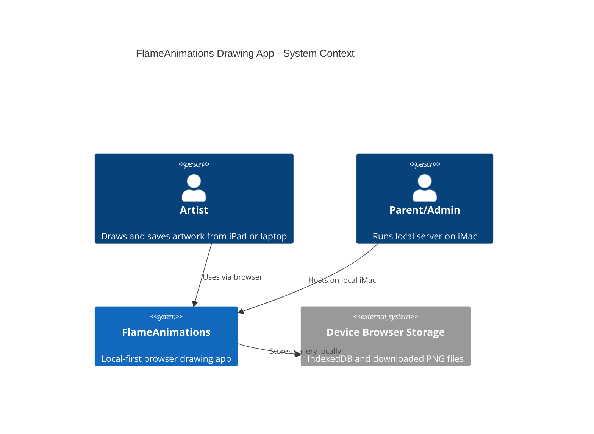
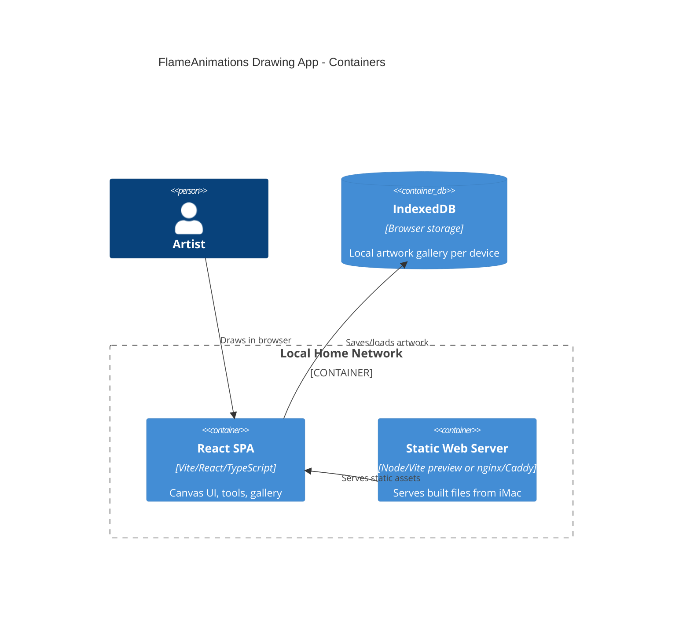

# FlameAnimations Drawing App — SPEC

Path: `docs/spec/SPEC.md`

## 1. TL;DR

FlameAnimations is a simple, local-first browser drawing app for a 12-year-old digital artist. It MUST run from an always-on local iMac and be usable from an iPad or laptop browser. MVP MUST provide a responsive canvas, color selection, brush size/shape controls, eraser, undo/redo, clear canvas, PNG export, and an in-browser gallery. V1 SHOULD add camera/photo import and custom brush presets.

## Repo Setup

| Path | Purpose |
|---|---|
| `/docs/spec/SPEC.md` | Product and engineering specification |
| `/docs/adr/` | Architecture Decision Records |
| `/docs/diagrams/` | Mermaid C4 diagrams |
| `/ROADMAP.md` | Milestones, gates, dependencies |
| `/CHANGELOG.md` | Keep-a-Changelog release notes |
| `/.github/ISSUE_TEMPLATE/` | Implementation issue templates |

## 2. Problem / Goals / Non-Goals

### Problem
The user needs a lightweight drawing app that can be hosted locally, opened in a browser, and used comfortably on both touch and mouse/trackpad devices without depending on cloud accounts or app stores.

### Goals
| ID | Goal | KPI |
|---|---|---|
| G1 | Make drawing immediately usable | User can draw within 5 seconds of page load |
| G2 | Support expressive basic art | At least 8 colors, custom color picker, 5+ brush sizes, 2+ brush shapes |
| G3 | Preserve artwork locally | User can export PNG and reopen saved gallery items |
| G4 | Keep deployment simple | One local web app command or static build served from iMac |
| G5 | Be hackable for learning | Codebase is small, readable, and documented |

### Non-Goals
- MVP MUST NOT require user accounts, cloud sync, paid services, or a remote database.
- MVP MUST NOT require App Store packaging.
- MVP MUST NOT support collaborative drawing.
- MVP MUST NOT store artwork on a third-party server.

## 3. Users & Use Cases

### Users
| Role | Description | Permissions |
|---|---|---|
| Artist | Primary 12-year-old user | Create, edit, save, export, delete own local artwork |
| Parent/Admin | Local server owner | Deploy app, update app, clear local data if needed |
| Future Builder | Same child learning development | Inspect code, add tools, customize brushes |

### Gherkin Acceptance Criteria

#### UC-1 Draw with brush
```gherkin
Given the app is open on an iPad or laptop
When the Artist chooses a color and brush size
And draws on the canvas
Then strokes MUST appear smoothly under touch, pencil, mouse, or trackpad input
And the selected color and size MUST be reflected in the stroke
```

#### UC-2 Change brush shape
```gherkin
Given the Artist is drawing
When the Artist chooses a round or square brush
Then subsequent strokes MUST use that brush shape
And previous strokes MUST remain unchanged
```

#### UC-3 Erase
```gherkin
Given existing artwork is on the canvas
When the Artist selects the eraser
Then drawing input MUST remove pixels from the canvas
And undo MUST restore the erased pixels
```

#### UC-4 Undo and redo
```gherkin
Given the Artist has made multiple drawing actions
When the Artist taps Undo
Then the most recent action MUST be reverted
When the Artist taps Redo
Then the reverted action MUST be restored
```

#### UC-5 Save PNG to device
```gherkin
Given artwork exists on the canvas
When the Artist taps Export PNG
Then the app MUST create a PNG file
And the browser MUST offer a download/share/save flow supported by the device
```

#### UC-6 Save to browser gallery
```gherkin
Given artwork exists on the canvas
When the Artist taps Save to Gallery
Then the app MUST store a preview and full image locally in the browser
And the artwork MUST be available after page reload on the same device/browser
```

#### UC-7 Camera/photo import
```gherkin
Given the app supports image import
When the Artist selects Camera/Photo Import
Then the app SHOULD allow camera capture or image-library selection where the browser permits it
And the selected image SHOULD be placed onto the canvas as a background or editable layer
```

## 4. Success Metrics & SLOs

### Product Metrics
| Metric | Target |
|---|---|
| First successful drawing session | Same day as MVP deployment |
| Page load to drawable canvas | ≤ 5 seconds on local Wi-Fi |
| Export success | ≥ 99% of attempted PNG exports in supported browsers |
| Gallery save success | ≥ 99% on browsers with IndexedDB available |

### SLIs / SLOs
| SLI | SLO | Error Budget |
|---|---|---|
| Local app availability on LAN | 99% during expected use hours | 1% |
| Initial page load p95 | < 2s on local Wi-Fi | 5% over target |
| Input latency p95 | < 50ms during normal canvas use | 5% over target |
| Save/export operation success | ≥ 99% | 1% failed ops |

### Alerts / Runbooks
- No automated paging required for home MVP.
- Parent/Admin SHOULD use a simple runbook: restart dev/static server, confirm iMac awake, confirm LAN IP/hostname, clear browser storage only after export backup.

## 5. Scope & Phasing

### MVP — ASAP
MUST include:
- Vite + React single-page app.
- HTML Canvas drawing surface.
- Pointer Events support for touch, Apple Pencil-compatible browser input, mouse, and trackpad.
- Color palette and custom color picker.
- Brush size slider.
- Round and square brush shapes.
- Eraser.
- Undo/redo action stack.
- Clear canvas with confirmation.
- Export PNG to device.
- Save/load/delete local gallery using IndexedDB.
- Responsive layout for iPad and laptop.
- Local network hosting from iMac.

### V1
SHOULD include:
- Camera/photo import using `<input type="file" accept="image/*" capture>`.
- Canvas resize presets.
- Custom brush presets.
- Keyboard shortcuts on laptop.
- Basic onboarding/help overlay.
- PWA installability for home-screen launch.

### VLater
MAY include:
- Layers.
- Stamps.
- Shape tools.
- Text tool.
- Animation frames / flipbook.
- Local multi-user profiles.
- Optional server-side shared gallery on the iMac.

## 6. Constraints & Assumptions

| Type | Item |
|---|---|
| Constraint | Must run through browser on iPad and laptop |
| Constraint | Must be hostable on late-2015 iMac |
| Constraint | MVP should avoid backend complexity |
| Assumption | Local network is trusted home LAN |
| Assumption | Devices use modern Safari/Chrome/Edge with Canvas, Pointer Events, IndexedDB |
| Assumption | Artwork is non-sensitive personal creative content |
| Assumption | `flameanimations.com` is project identity/brand, not necessarily deployment target for MVP |
| Assumption | ASAP means prioritize a small working MVP over advanced tools |

## 7. Security / Privacy / Compliance

### Security Target
- Target: OWASP ASVS-inspired baseline appropriate for a local-only static app.
- Formal ASVS L2 is NOT required for MVP because there is no auth, backend API, or internet-facing service.
- If exposed outside LAN, the project MUST add HTTPS, auth, update process, and security review.

### Privacy
- Artwork MUST remain on the device unless the user explicitly exports or shares it.
- Gallery data MUST be stored in the browser on the same device.
- Camera/photo import MUST require explicit browser permission/selection.
- App MUST NOT include analytics, tracking pixels, third-party ads, or remote telemetry in MVP.

### Threat Model
| Threat | Mitigation |
|---|---|
| Other LAN users access app | Accept for MVP; add password if LAN trust changes |
| Accidental deletion | Confirm destructive actions; encourage PNG export |
| Browser storage loss | Provide export; document gallery is not a backup |
| Malicious uploaded image | Use browser image decoding only; no server processing |
| Internet exposure | Do not port-forward MVP; require HTTPS/auth before external access |

## 8. Architecture Overview

### C4 L1 — Context


### C4 L2 — Containers


### High-Level Data Model
| Entity | Fields |
|---|---|
| Artwork | `id`, `title`, `createdAt`, `updatedAt`, `width`, `height`, `thumbnailPng`, `fullPngBlob` |
| ToolState | `color`, `brushSize`, `brushShape`, `mode`, `opacity` |
| HistoryEntry | `id`, `timestamp`, `imageDataSnapshot` or compressed operation |

## 9. API & Data Contracts

MVP has no backend API.

### Local Storage Contracts
- Gallery MUST use IndexedDB, not only `localStorage`, because image blobs can exceed localStorage limits.
- Export MUST use `canvas.toBlob("image/png")`.
- File names SHOULD follow: `flameanimations-YYYYMMDD-HHMMSS.png`.

### Future API Note
If shared gallery is added later, introduce `openapi.yaml` with endpoints for artwork upload/list/download/delete and auth.

## 10. UX & Content

### Layout
- Large canvas as primary focus.
- Tool rail or top toolbar with:
  - Color picker
  - Brush size
  - Brush shape
  - Brush/eraser toggle
  - Undo/redo
  - Save Gallery
  - Export PNG
  - Clear
- Gallery drawer or page for saved works.

### Key States
| State | Requirement |
|---|---|
| Empty canvas | MUST show blank drawable area |
| Drawing | MUST avoid page scroll while drawing on canvas |
| Saving | SHOULD show success/failure feedback |
| Error | MUST explain browser/device limitation plainly |
| Gallery empty | SHOULD show helpful empty state |
| Import unsupported | SHOULD hide or disable camera import gracefully |

### Accessibility
- Target WCAG 2.1 AA where practical.
- Controls MUST have accessible names.
- Keyboard controls SHOULD work for common actions.
- UI MUST not rely on color alone.

## 11. Testing Strategy

| Test Type | Coverage |
|---|---|
| Unit | Tool state, gallery persistence helpers, filename generation |
| Component | Toolbar, gallery, save/export buttons |
| Integration | Draw → undo → redo → save → reload → open |
| E2E | iPad Safari smoke test, laptop Chrome/Safari smoke test |
| Non-functional | Large canvas performance, repeated saves, offline/LAN use |

Manual MVP Test Checklist:
- Draw with finger/mouse.
- Change colors and brush size.
- Erase and undo.
- Export PNG.
- Save to gallery, reload, reopen.
- Confirm app works from another LAN device.

## 12. Observability & Ops

MVP:
- Browser console logs only for errors.
- Optional local debug panel MAY show app version, storage availability, and canvas size.
- No external telemetry.

Runbooks:
| Runbook | Steps |
|---|---|
| App unavailable | Confirm iMac awake → confirm server process → restart server → check LAN address |
| Save failed | Export PNG → check browser storage permission → clear old gallery items |
| Performance slow | Reduce canvas size → close other tabs → restart browser |

## 13. Release & Rollout

- Environments: local dev, local production static build.
- Versioning: SemVer.
- Changelog: Keep-a-Changelog.
- Rollback: keep prior build folder or Git tag.
- Deployment:
  1. `npm install`
  2. `npm run build`
  3. `npm run preview -- --host 0.0.0.0`
  4. Access from iPad/laptop via iMac hostname or LAN IP.

## 14. Risks & Mitigations

| Risk | Owner | Mitigation |
|---|---|---|
| iPad Safari quirks | Developer | Test early on target iPad |
| Browser storage eviction | Artist/Parent | Export important artwork as PNG |
| Canvas history memory growth | Developer | Cap undo stack; use snapshots or operation batching |
| Local server not reachable | Parent/Admin | Document LAN hosting and restart steps |
| Scope creep into pro art app | Parent/Admin | Preserve MVP/V1/VLater boundaries |

## 15. Decision Log

- [ADR-0001 Frontend Stack](../adr/0001-frontend-stack.md)
- [ADR-0002 Local First Storage](../adr/0002-local-first-storage.md)
- [ADR-0003 No Backend For MVP](../adr/0003-no-backend-for-mvp.md)
- [ADR-0004 Browser Based Deployment](../adr/0004-browser-based-deployment.md)
- [ADR-0005 Privacy And Telemetry](../adr/0005-privacy-and-telemetry.md)

## 16. Roadmap & Work Plan

See [`ROADMAP.md`](../../ROADMAP.md).

## 17. Glossary & References

| Term | Meaning |
|---|---|
| Canvas | HTML drawing surface |
| IndexedDB | Browser database used for local gallery |
| PWA | Progressive Web App, installable browser app |
| LAN | Local area network |
| MVP | Minimum viable product |
